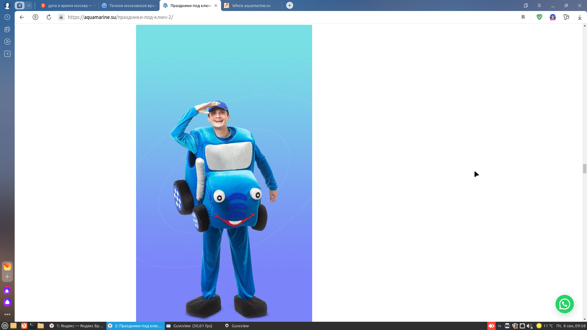
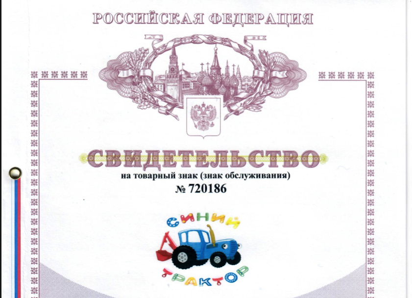
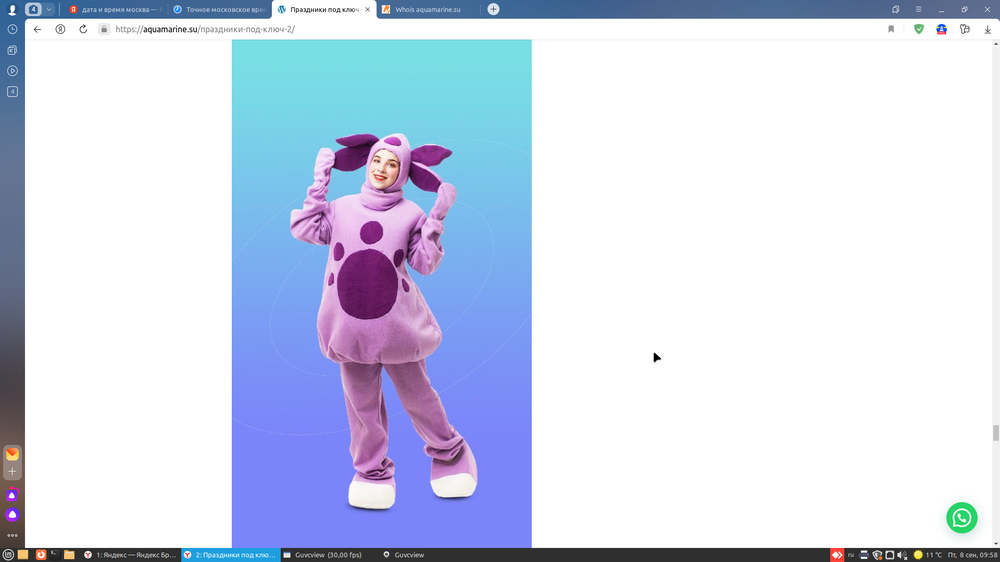
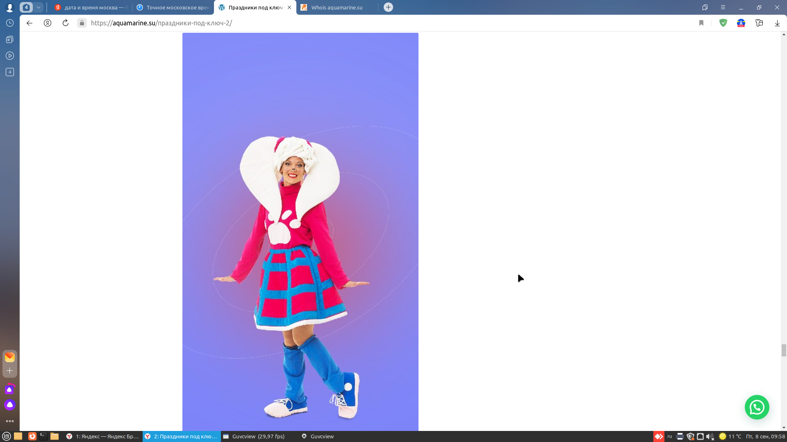
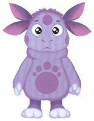
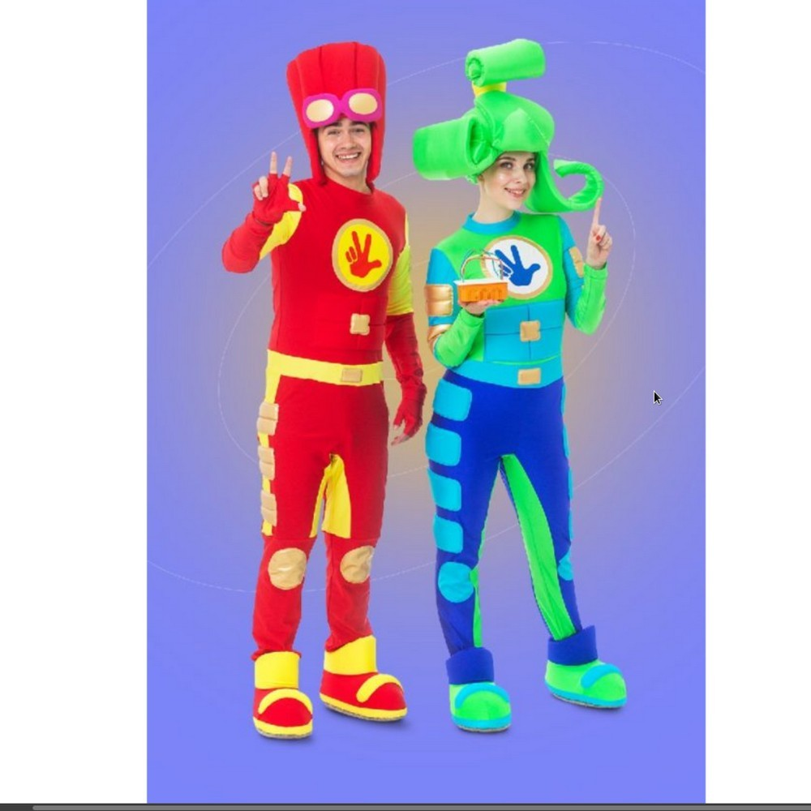
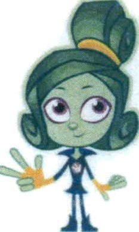
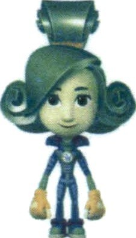

# Один сайт, четыре иска: как фото аниматоров стали нарушением прав на мультперсонажей

_Черновик статьи для Хабра. Тон намеренно язвительный. Перед публикацией стоит еще раз проверить формулировки, относящиеся к конкретным лицам и компаниям._

Есть старый русский бизнес-урок: если у тебя маленькая студия, сайт на коленке, подрядчик с хорошими намерениями и фотографии аниматоров в костюмах, то однажды ты можешь обнаружить, что правовая система и правообладатели смотрят на это совсем не как на «фото услуги». Не буквально, конечно. Буквально у тебя на сайте фото услуги. Но юридически это уже может оказаться достаточно похоже на использование товарных знаков, произведений изобразительного искусства, образов персонажей и всего того, что в иске хорошо смотрится рядом с фразой «взыскать компенсацию».

И вот в этот момент российское правосудие показывает себя с лучшей стороны. Спокойно. С достоинством. И с крайне ограниченным интересом к реальности, в которой вообще-то есть разница между мультяшным 2D-рисунком и фотографией человека в костюме на странице «Праздники под ключ».

Когда люди говорят «ну что такого, поставили пару картинок на сайт», обычно они представляют максимум письмо с просьбой удалить контент. В моем случае все вышло тоньше: на сайте были фотографии аниматоров в костюмах, а иски, претензии и решения пошли как за использование охраняемых 2D-рисунков персонажей и товарных знаков. Именно эта подмена плоскостей, а уже потом расходы на «фиксацию нарушения» по `10 000 рублей` в каждом деле, и стала для меня очень бодрой демонстрацией того, как в России работает интеллектуальное право, когда оно встречается с маленьким бизнесом, старым сайтом и судебным конвейером.

Я айтишник. Не медиамагнат, не владелец сети франшиз, не пиратский CD-барон из 2007-го. Моя жена художник-декоратор. Какое-то время она занималась студией и оформлением пространства для детских праздников, фотосессий и мероприятий. Под это был сделан сайт. Как это обычно бывает у малого бизнеса, сайт собирался без большого бюджета, кусками, через подрядчиков, знакомых и «ну вот еще это добавьте». Один из подрядчиков, которого в семейной памяти проще всего обозначить как «Гайка», передал фотографии и материалы для сайта. Они и были размещены.

Потом выяснилось, что мир устроен интереснее, чем хотелось бы.

Не в том смысле, что кто-то написал, мол, у вас спорный контент, давайте разберемся. Нет. В том смысле, что спустя время внезапно обнаруживается: на один и тот же сайт можно аккуратно навесить несколько самостоятельных исков от разных правообладателей, по каждому посчитать компенсацию, по каждому приложить скриншоты, по каждому включить судебные расходы, а затем объяснить, что все это не злоупотребление, а торжество закона, разумности и справедливости.

Да, именно справедливости. Суд это слово тоже использует.

## Краткая фабула

Сайт: `aquamarine.su`.

Суть претензий: на сайте были фотографии аниматоров в костюмах персонажей, а защищаются при этом авторские права на рисованные 2D-изображения персонажей и товарные знаки.

Что произошло дальше:

1. Разные правообладатели подали отдельные иски.
2. Основание в трех делах одно и то же: осмотр сайта `aquamarine.su` от `08.09.2023`.
3. В каждом деле отдельно заявлены:
   - компенсация за товарные знаки;
   - компенсация за изображения;
   - `10 000 руб.` расходов на фиксацию;
   - госпошлина;
   - почтовые расходы и прочее по мелочи.
4. В результате один старый контент на одном сайте превращается в серию отдельных судебных историй.

На человеческом языке это звучит так: если у вас на сайте были фотографии аниматоров в костюмах, то дальше можно спорить уже не о фотографиях, а о том, насколько уверенно их превратят в «рисунки (изображения)» персонажей.

## Кто я в этой истории

Это важно для контекста, потому что в комментариях к подобным кейсам всегда находится человек с тезисом «ну предприниматель должен был знать».

Я действительно ИП. Но по факту это история не про осознанную стратегию использования чужого бренда. Это история про обычный малый бизнес:

- у жены была студия и декораторская работа;
- сайт делался не как юридически выверенная витрина для IPO, а как обычный сайт маленькой студии;
- материалы на сайт частично приходили от подрядчика;
- контент потом был удален;
- никакой торговли мерчем, тиражирования продукции или масштабного заработка на чужих персонажах не было.

Но в логике судебного конвейера это почти не имеет значения. Если нашелся правообладатель, его представитель, скриншоты, сравнение с мультяшным персонажем, договор на «фиксацию» и арбитражный шаблон, дальше включается очень рациональная механика взыскания.

## Главный абсурд

Главный абсурд этой истории для меня даже не в количестве дел. Не в пошлинах. Не в фиксации. Он в том, что в реальности на сайте были фотографии аниматоров в костюмах, а в судебной реальности это без особых душевных колебаний превращается в использование:

- товарных знаков;
- «рисунков (изображений)» персонажей;
- «графических изображений» персонажей;
- «образов рисунков» при предложении услуг аниматоров.

То есть в мире обычного человека есть разница между:

- мультяшным 2D-рисунком;
- фотографией живого человека;
- сценическим костюмом;
- страницей сайта с услугами праздников.

А в мире этих дел разница уже не так важна. Если суд усматривает достаточное «визуальное и графическое сходство», фотография аниматора в костюме начинает жить как юридически опасная тень 2D-персонажа.

И это не публицистическое преувеличение. Это буквально видно из материалов.

В деле Днепровского спор идет о «графическом изображении персонажа "Синий трактор"», но одновременно в решении и возражениях фигурируют формулировки про «размещение изображений с аниматорами в костюмах» и предложение услуг аниматоров.

В делах Мельницы и СТС используется та же логика: на сайте фиксируются предложения услуг аниматоров, а дальше в иске это упаковывается как использование «рисунков (изображений)» персонажей и товарных знаков.

В деле Аэроплана аналогично спор идет о рисунках «Верта» и «Файер», хотя фактическая сцена та же: сайт, страница услуг, фотографии аниматоров, сравнение с рисоваными образами.

Именно это место мне кажется самым важным для обсуждения. Потому что обычный предприниматель не думает: «Сейчас я выложу фото аниматора в костюме и тем самым использую произведение изобразительного искусства в виде 2D-рисунка». Он думает: «У меня на сайте фотография услуги».

## Как из одного сайта делается несколько дел

Вот четыре дела, которые я сейчас разбираю:

| Дело | Истец | Дата фиксации | Что заявлялось / взыскано |
|---|---|---:|---|
| `А45-39161/2025` | ИП Днепровский | `08.09.2023` | решение есть, взыскано `30 156 руб.` |
| `А45-39132/2025` | ООО «САК Мельница» | `08.09.2023` | иск по материалам на `100 000 руб.` компенсации плюс расходы |
| `А45-42946/2025` | АО «СТС» | `08.09.2023` | иск по материалам на `100 000 руб.` компенсации плюс расходы |
| `А45-39342/2025` | АО «Аэроплан» | `28.06.2023` | решение по резолютивной части: взыскано `60 156 руб.` |

Если смотреть формально, это разные правообладатели, разные объекты, разные дела. Если смотреть по-человечески, это один и тот же сайт детской студии, один и тот же ответчик, фотографии аниматоров в костюмах, и в трех делах одна и та же дата осмотра сайта: `08.09.2023`.

Особенно изящно здесь то, что фотография на странице услуг сначала превращается в «использование рисунка», а уже потом обрастает судебными расходами.

## Как это превращается в иск

Сначала происходит главный фокус: фото аниматора в костюме признается достаточно похожим на охраняемый рисованный образ. Потом в дело вступает вторая магия: «фиксация». Не нотариальный протокол за космические деньги. Не сложная экспертиза. А обычный, по сути, пакет:

- договор поручения;
- акт выполненных работ;
- платежное поручение;
- заверенные скриншоты;
- иногда видеозапись осмотра.

И дальше это превращается в полноценный иск, в котором уже можно взыскать и компенсацию, и судебные расходы.

Теперь фактура по моим делам.

### Днепровский

В деле `А45-39161/2025` приложен акт `№202А` от `31.07.2025`. В этом акте перечислены несколько сайтов и фиксаций. По `aquamarine.su` там стоит дата `08.09.2023` и цена `10 000 руб.`.

Отдельно есть платежное поручение `№13543` от `20.10.2025` на `50 000 руб.`. То есть оплачивается не какой-то уникальный осмотр именно моего сайта, а целый акт с несколькими фиксациями.

Суд в решении от `16.03.2026` взыскал:

- `10 000 руб.` за товарный знак;
- `10 000 руб.` за изображение «Синий трактор»;
- `10 000 руб.` расходов на фиксацию;
- `156 руб.` почтовых;
- `10 000 руб.` госпошлины.

Итого: `40 156 руб.`.

### Мельница

В деле `А45-39132/2025` есть акт `№198А` от `29.02.2024`. Там тоже фигурирует `aquamarine.su` от `08.09.2023`, тоже с ценой `10 000 руб.` за эту фиксацию.

То есть второй правообладатель приходит в суд и говорит: да, это еще и наше, и да, еще отдельно `10 000` за фиксацию.

### СТС

В деле `А45-42946/2025` есть акт `№242А` от `28.02.2025`, в котором строка `11` это опять `08.09.2023`, опять `aquamarine.su`, опять `10 000 руб.`.

Платежное поручение `№16770` от `25.12.2025` уже на `200 000 руб.` за весь акт, где перечислено `20` фиксаций. Но в конкретном деле к взысканию идет привычная красивая цифра `10 000`.

### Аэроплан

Здесь картина другая. В деле `А45-39342/2025` акт `№258А` от `28.02.2025`, но по `aquamarine.su` указана другая дата фиксации: `28.06.2023`. И исполнитель там уже не Голованов, а Тарасова.

То есть это не буквально та же самая фиксация, а отдельный осмотр того же сайта раньше по времени.

И тем не менее итог понятен: еще одно дело, еще одна компенсация, еще одни `10 000` расходов на фиксацию.

## Где здесь начинается цирк

С точки зрения формального права мне легко возразят:

- у каждого правообладателя свой объект права;
- у каждого свой иск;
- у каждого свой акт;
- у каждого своя компенсация;
- у каждого свои расходы.

Именно так все это и оформлено.

Но если посмотреть на экономический смысл происходящего, возникает несколько неудобных вопросов.

### 1. Почему фото аниматора в костюме это уже «рисунок»

Вот это базовый вопрос.

Сайт маленькой студии праздников рекламирует аниматоров, костюмы и оформление. Он не публикует библиотеку оригинальных 2D-артов и не выдает себя за официальный ресурс правообладателя. Но в делах мы видим очень уверенный переход:

- фото на странице услуги;
- затем «спорное изображение»;
- затем «образ персонажа»;
- затем «рисунок (изображение)»;
- затем компенсация за нарушение прав на произведение изобразительного искусства.

Для юриста по интеллектуальным правам это, вероятно, уже привычно. Для обычного малого бизнеса это просто ловушка.

### 2. Почему один сайт можно «осматривать» многократно с одинаковой процессуальной монетизацией

В трех делах используется одна и та же дата осмотра сайта: `08.09.2023`.

То есть один и тот же сайт, один и тот же контент, один и тот же ответчик, одна и та же дата. Но по факту это дает трем разным истцам возможность отдельно взыскать по `10 000 руб.` за фиксацию.

С точки зрения здравого смысла это выглядит не как возмещение необходимых издержек, а как платный входной билет в каждый новый иск.

### 3. Почему платежка за большой пакет работ превращается в «ровно 10 000 именно по этому делу»

Во всяком случае по Днепровскому и СТС видно, что платежки оплачивают крупные акты, в которых много разных фиксаций по разным сайтам и ответчикам.

Но в суде это подается как аккуратный расход именно по моему делу. Слишком удобно, чтобы не работать.

### 4. Почему малый бизнес здесь рассматривается как идеальный донор процессуальных издержек

Если бы речь шла о крупной компании с юридическим департаментом и нормальным комплаенсом по интеллектуальным правам, ладно. Но механизм одинаково бодро работает и против крошечного бизнеса, где сайт делал кто попало, контент размещался подрядчиком, а весь оборот несопоставим с тем, что потом можно накрутить исковыми требованиями.

В этом месте правосудие очень любит говорить о защите исключительных прав и почему-то почти никогда не любит говорить о соразмерности последствий.

## А что со «справедливостью»

В решениях суды регулярно ссылаются на разумность, справедливость, соразмерность и законность. Особенно красиво это читается рядом с тем, как работает компенсация по интеллектуальным правам.

Логика примерно такая:

- правообладатель не обязан доказывать размер реального ущерба;
- минимальная компенсация уже предусмотрена законом;
- суд не обязан входить в мирские подробности про «это старый сайт маленькой студии»;
- если у ответчика нет дорогой и долгой процессуальной защиты, все едет дальше по рельсам.

То есть реальный вред может быть спорным, экономический эффект для ответчика разрушительным, а конструкция все равно считается справедливой, потому что правильно заполнены поля в иске.

В деле Днепровского суд прямо указал, что:

- скриншоты и ответ регистратора достаточны;
- ходатайства об истребовании дополнительных доказательств отклоняются;
- экспертиза не нужна;
- предложение услуг на сайте уже достаточно для нарушения;
- размещение изображений с аниматорами в костюмах рассматривается как использование спорных образов;
- `10 000 руб.` расходов на фиксацию подлежат взысканию полностью.

Это очень удобная справедливость. Бумажная. Самодостаточная. Не перегруженная лишним состраданием к реальности.

## Что особенно неприятно

Самое неприятное даже не размер одного конкретного иска. Самое неприятное то, что система масштабируется.

Старый сайт детской студии может:

- рекламировать фото аниматоров, а получить квалификацию использования 2D-персонажей;
- попасть под несколько правообладателей;
- дать несколько самостоятельных дел;
- в каждом деле тянуть отдельную госпошлину на апелляцию;
- в каждом деле тащить по `10 000` за фиксацию;
- в сумме вырасти до суммы, которую микробизнес просто не воспринимает как «судебный спор».

Условно, вы не продаете контрафакт контейнерами. Вы просто когда-то неудачно разместили фотографии аниматоров на сайте. Но процессуально к вам можно приходить так, как будто вы построили франшизу на чужих персонажах.

## Два практических инсайта, о которых почему-то не предупреждают

### 1. На Госуслугах вам, скорее всего, ничего внятного не придет

Это отдельный сюрприз для людей, которые почему-то еще верят в цифровое государство.

Нормальный человек предполагает примерно такую логику:

- на тебя подали иск;
- тебе приходит официальное понятное уведомление;
- ты открываешь его в одном окне;
- видишь, кто, за что, куда, какие сроки;
- дальше спокойно реагируешь.

В реальности это работает куда более поэтично.

Сначала у тебя может не быть никакого ясного сигнала на `Госуслугах`. Зато потом внезапно начинается другой вид государственной информатизации: поток звонков, писем и сообщений от юридических фирм, которые уже почему-то прекрасно знают, что у тебя проблемы.

И вот это отдельный жанр абсурда. Государственная система, которая должна уведомлять тебя как участника процесса, делает это в лучшем случае невнятно. Зато рынок юридических услуг срабатывает бодро, быстро и с прекрасной конверсией.

То есть о том, что на тебя подали иск, ты узнаешь не от государства как от организатора процесса, а от людей, которые уже хотят на тебе заработать.

Лично у меня это вызывало не желание «срочно заключить договор с юрфирмой», а ровно обратную реакцию. Я не хочу связываться с теми, кто появляется раньше, чем ты вообще успеваешь нормально понять, что произошло.

И это тоже важная часть истории для малого бизнеса: если вы думаете, что вас аккуратно, официально и по-человечески предупредят, лучше заранее избавиться от этой иллюзии.

### 2. Очное присутствие в суде это не «возможность объяснить свою позицию», а ритуал подчинения

Есть популярная наивная мысль: «ну ладно, если что, приду в суд и объясню по-человечески».

Нет.

Очное присутствие в таком процессе воспринимается не как шанс на нормальный разговор, а как участие в очень специфическом ритуале, где:

- тебя особо не собираются слушать;
- говорить надо не так, как ты реально думаешь, а так, как положено в их языке;
- постоянно надо вставать;
- говорить «Ваша честь»;
- ловить процессуальные сигналы, которые для обычного человека вообще неестественны;
- и при этом еще пытаться не выглядеть идиотом на фоне людей, которые этот ритуал крутят каждый день.

Именно это ощущается унизительно.

Не потому, что суд не должен быть формальной процедурой. Формальность как раз бывает полезна. Унизительно другое: когда тебе фактически дают понять, что твои нормальные слова, твой обычный язык и твоя человеческая логика здесь вторичны. Ты должен сначала пройти через языковой и поведенческий фильтр системы, и только потом, возможно, тебе позволят произнести что-то содержательное.

А содержательное, кстати, тоже не факт что кого-то заинтересует.

Потому что когда конструкция уже собрана как:

- правообладатель;
- скриншоты;
- акт фиксации;
- сравнение с рисунком;
- требование компенсации;

твое живое объяснение в духе «на сайте были фото аниматоров, а не рисованные картинки» часто воспринимается не как важный факт, а как шум между документами.

И вот здесь ИИ, как ни странно, оказывается гуманнее системы. С ним хотя бы можно разговаривать на обычном языке, не вставая каждые несколько минут и не произнося обязательных словесных поклонов.

## Отдельный штрих к картине: один и тот же представитель по доверенности

Когда начинаешь разбирать несколько дел подряд не как случайный ответчик, а как человек с grep, папками и упрямством, начинает проступать еще одна деталь. В материалах разных дел повторяется один и тот же представитель истцов по доверенности. В моих материалах это фамилия вида `Скотнико**а Н.Ю.`.

Я намеренно не пишу полную фамилию в публичном тексте, хотя в судебных документах и на заверенных скриншотах она встречается. Формально это публичный процессуальный контекст, но тащить полные персональные данные в публикацию без необходимости я не вижу смысла. Для статьи достаточно того факта, что это один и тот же представитель, который регулярно всплывает в нескольких похожих историях.

И вот тут у обычного человека закономерно возникает неприятное ощущение конвейера.

Не в том смысле, что я могу доказать какой-то «заговор». Не в том смысле, что суд установил существование специальной схемы. Этого я не утверждаю. Но как ответчик, который видит несколько однотипных дел, одни и те же приемы, одни и те же конструкции и одного и того же представителя по доверенности, я имею право на оценочное суждение: это выглядит как поточная модель взыскания.

В ИТ-среде и в интернет-дискуссиях для таких явлений обычно используют слова вроде `copyright trolling` или по-русски что-то в духе «патентный/копирайт-троллинг», хотя терминологически здесь речь не о патентах, а шире о серийном взыскании на интеллектуальных правах. Еще раз: это именно моя публицистическая оценка происходящего, а не установленный судом юридический факт.

Снаружи это выглядит так:

- есть правообладатели;
- есть представитель по доверенности;
- есть набор типовых процессуальных инструментов;
- есть старые сайты малого бизнеса;
- дальше из этого собирается воспроизводимая модель взыскания.

И если ты сидишь с другой стороны стола, ощущается это не как «высокая защита интеллектуальной собственности», а как вполне земная конвейерная юридическая практика.

## Как я разгребал это как айтишник, а не как юрфирма

Когда ты получаешь пачку арбитражных дел, проблема быстро перестает быть только юридической. Она становится технической: PDF, определения, иски, акты, платежки, решения, скриншоты, приложения. Поэтому я собрал рабочий пайплайн и стал разгребать это как айтишник.

### 1. Структурировал каждое дело как проект

Я разложил все по отдельным папкам дел:

- `01_Материалы_КАД` для исходных PDF из картотеки;
- `80_ИИ/text` для извлеченного текста;
- `80_ИИ/images` для картинок и рендеров страниц;
- служебные папки для временных файлов, заметок и отправленных документов.

Пока материалы лежат одной свалкой, никакая модель не спасет. Когда у тебя одно дело = одна папка = понятные подпапки, уже можно нормально искать, сравнивать и скармливать это ИИ.

### 2. Превратил PDF в текст

Большая часть судебной жизни приходит в PDF, а PDF для анализа это обычно ад: где-то нормальный текст, где-то сканы, где-то кривой OCR. Поэтому следующий шаг был простой: вытаскивать из PDF пригодный для поиска текст и отдельно рендерить страницы в изображения для визуальной сверки.

В результате у меня на каждый документ появились:

- `.txt` версия для быстрого полнотекстового поиска;
- набор изображений страниц;
- иногда отдельные выгрузки и временные представления для проблемных файлов.

Вместо «открой 20 PDF и умри» появляется возможность делать нормальный grep по делу:

- где упоминается `aquamarine.su`;
- где именно стоит дата `08.09.2023`;
- в каких актах фигурирует `10 000`;
- где говорится про `рисунки (изображения)`;
- где сами истцы пишут про `аниматоров в костюмах`.

### 3. Использовал Cursor IDE как рабочий стол для всего дела

Cursor в этой истории оказался не «AI coding toy», а нормальным расследовательским интерфейсом. Он дал:

- быстрый поиск по всей папке дела;
- удобный просмотр дерева файлов;
- работу сразу с markdown-заметками, txt, скриптами и черновиками документов;
- возможность держать в одном контексте и материалы дела, и свои возражения, и черновики жалоб, и статьи вроде этой.

По сути я использовал Cursor не только как редактор, а как среду разбора судебного корпуса:

- нашел все упоминания конкретной даты;
- сравнил акты по разным делам;
- вытащил формулировки из решений;
- сопоставил иски, акты, платежки и претензии;
- собрал аргументы, где фото аниматоров на сайте превращаются в «рисунки».

Когда у тебя четыре похожих дела, это важнее любой красивой теории.

### 4. Подключил последние модели ИИ как судебных разборщиков бумаги

Здесь отдельная ирония судьбы: чтобы отбиваться от очень аналогового правосудия, пришлось использовать вполне современный стек. Я гонял материалы через GPT-5.3 не в формате «ИИ, реши за меня суд», а как аналитический слой поверх папок с делами:

- вычлени из решения ключевые выводы;
- сопоставь иск и резолютивную часть;
- найди противоречия;
- покажи, где в разных делах одна и та же фиксация;
- вытащи позиции истца по поводу «рисунков», «аниматоров», «сходства»;
- собери краткую сводку по каждому делу;
- помоги сформулировать доводы без утраты фактуры.

Ценность ИИ тут не в магии, а в скорости перебора руды. Он не заменяет голову, но отлично заменяет унылый ручной просмотр одинаковых PDF по кругу.

И да, на этом роль ИИ не заканчивалась. Он помогал не только «понять дело», но и протащить через себя почти весь бытовой судебный pipeline:

- собрать черновик ходатайства под конкретную ситуацию;
- вытащить из материалов нужные даты, номера дел, ссылки на приложения;
- перепроверить, что в тексте заявления не поплыли суммы и формулировки;
- собрать итоговый текст под подачу;
- помочь привести документ к PDF-формату без ручной возни;
- подсказать последовательность подписи и отправки через `Мой арбитр`.

То есть ИИ у меня работал не как «умная Википедия», а как процессуальный экзоскелет.

### 5. Пайплайн выглядел примерно так

1. Скачать материалы дела из картотеки.
2. Разложить по папкам.
3. Извлечь текст из PDF в `.txt`.
4. Отрендерить страницы в изображения для визуальной сверки.
5. Прогнать поиск по ключевым словам, датам, суммам, доменам, фамилиям, номерам актов.
6. Через Cursor IDE и модель собрать таблицу: дело, дата фиксации, истец, акт, платежка, решение, суммы.
7. Отдельно прогнать вопрос, который обычный юрист часто проговаривает слишком общо: «что здесь вообще фактически изображено на сайте?» Ответ в моем случае был прост: фотографии аниматоров в костюмах.
8. Уже после этого собирать возражения, ходатайства, жалобы и публицистический текст.
9. Сводить черновик в PDF, проверять комплект приложений, подписывать и отправлять через `Мой арбитр`.

### 6. Что ИИ реально помог увидеть

Самое полезное было не в красивых формулировках, а в очень приземленных вещах:

- три дела завязаны на одну и ту же дату осмотра `08.09.2023`;
- по нескольким делам повторяется одна и та же фактическая сцена сайта;
- истцы сами пишут про предложения услуг аниматоров;
- при этом правовая квалификация едет через «рисунки (изображения)» и товарные знаки;
- часть платежек оплачивает крупные акты целиком, а не некую уникальную услугу ровно по одному делу.

ИИ помог не «придумать защиту», а сделать видимым тот рисунок дела, который вручную легко утонул бы в бумаге.

### 6.1. Что ИИ реально помог сделать руками

Это тоже важная часть. В какой-то момент ты устаешь не от права, а от офисной механики:

- собрать ходатайство;
- не забыть реквизиты суда и номер дела;
- правильно назвать приложения;
- не потерять дату заседания;
- выгрузить нормальный PDF;
- подписать;
- отправить через `Мой арбитр`;
- потом проверить, что ушло именно то, что ты хотел отправить, а не очередная процессуальная ерунда.

Вот здесь ИИ оказался особенно полезен. Он помогал:

- собирать из материалов дела черновики ходатайств об ознакомлении, приобщении документов, пояснений и возражений;
- быстро адаптировать шаблон под конкретное дело, а не переписывать все вручную;
- проверять логику документа перед отправкой;
- превращать разрозненные заметки в связный процессуальный текст;
- сопровождать технический хвост: PDF, подпись, отправка через `Мой арбитр`.

Если совсем грубо, у меня получился такой режим работы:

1. Я формулирую задачу.
2. ИИ вытягивает фактуру из дела.
3. ИИ собирает черновик документа.
4. Я правлю, где нужно человеческое чувство риска.
5. Документ уходит в PDF.
6. Подписываю.
7. Отправляю через `Мой арбитр`.

И это, пожалуй, самая приземленная, но и самая полезная часть всей истории. Потому что в реальном процессе побеждает не тот, кто красивее рассуждает о природе товарного знака, а тот, кто успел вовремя собрать вменяемый документ и не ошибся в трех местах, за которые суд потом формально накажет.

### 7. Почему без такого пайплайна сейчас просто тяжело

Современный судебный спор это уже не только право. Это обработка документационного массива.

Если у тебя:

- несколько дел;
- десятки PDF;
- акты, платежки, определения, отзывы, претензии;
- похожие формулировки в разных документах;
- сроки, которые не ждут;

то без нормального пайплайна ты тратишь силы не на позицию, а на археологию.

И вот в этом месте ИИ оказался не игрушкой, а способом вернуть себе темп. Печально только то, что использовать GPT-5.3 и IDE уровня Cursor пришлось не для стартапа, а для того, чтобы понять, как именно тебя процессуально прижимают за фотографии аниматоров на сайте.

## Вывод, который мне не нравится

Если у вас маленький бизнес, сайт, подрядчики и когда-то кто-то «просто поставил фото аниматоров», вы не в серой зоне. Вы уже в готовой воронке.

Сценарий простой:

1. Находится спорный контент.
2. Фото аниматоров в костюмах интерпретируются как использование персонажей, рисунков и товарных знаков.
3. Делается осмотр сайта.
4. Правообладатели приходят по отдельности.
5. Каждый иск живет своей жизнью.
6. Каждый тянет отдельные расходы.
7. Апелляция тоже отдельная и тоже платная.

То есть даже если вы хотите спорить хотя бы с очевидно повторными расходами, вы платите госпошлину за каждую отдельную жалобу. Очень воспитательный механизм. Практически говорит предпринимателю: «Надо было заранее быть юристом по интеллектуальному праву, веб-мастером, контент-менеджером и внутренней службой комплаенса одновременно».

## Итоги в цифрах

Чтобы весь этот сюжет не выглядел просто эмоциональной колонкой, вот сухой итог по цифрам.

### Что было на старте

По тем материалам, которые у меня на руках по четырем делам, стартовая картина выглядела так:

- `А45-39161/2025` Днепровский: изначально `50 000 руб.` компенсации плюс судебные расходы;
- `А45-39132/2025` Мельница: `100 000 руб.` компенсации плюс судебные расходы;
- `А45-42946/2025` СТС: `100 000 руб.` компенсации плюс судебные расходы;
- `А45-39342/2025` Аэроплан: изначально `100 000 руб.` компенсации плюс судебные расходы.

То есть только стартовые требования по компенсациям суммарно составляли `350 000 руб.`.

Если добавить типовой хвост из:

- `10 000 руб.` расходов на фиксацию;
- `10 000 руб.` госпошлины;
- почтовых расходов;
- иногда `200 руб.` за выписку,

то по четырем делам совокупный размер претензий уже выглядел примерно как `400+ тыс. руб.` еще до учета апелляций, времени, нервов и всего остального.

Если же считать полную стоимость защиты, включая отдельные госпошлины за апелляции, потерянное время и необходимость разбирать весь этот документный вал, то психологически и экономически история вполне легко ощущается как путь к `полумиллиону`.

### Что удалось выжать с помощью ИИ

Здесь важно не приукрашивать. ИИ не сделал из меня человека, который волшебно обнулил все иски. Но он дал вполне измеримый результат:

1. Я не пошел по пути «срочно нанять первую попавшуюся юрфирму», а разобрал массив документов сам.
2. Я структурировал `4` дела, вытащил из PDF текст, разложил доказательства и свел их в сопоставимую базу.
3. Я увидел ключевой паттерн: по `3` делам используется одна и та же дата осмотра сайта `08.09.2023`.
4. Я отдельно увидел и смог нормально сформулировать главный абсурд конструкции: на сайте были фото аниматоров в костюмах, а спор юридически едет через `рисунки (изображения)` и товарные знаки.
5. Я собрал и подал процессуальные документы без аутсорса на каждом шаге: ходатайства, пояснения, возражения, черновики жалоб.
6. Я уже подал `апелляционную жалобу`, и на момент публикации она `в процессе`.

По конкретным суммам на уже разобранных решениях:

- в деле `А45-39161/2025` после уменьшения исковых требований и решения суда взыскано `30 156 руб.`;
- в деле `А45-39342/2025` по резолютивной части взыскано `60 156 руб.`.

То есть только по двум уже разобранным решениям получилось `90 312 руб.` взыскания. И именно поэтому для меня принципиально важны не только деньги, но и сам способ, которым фото услуги превращаются в объект для серийного взыскания.

### Где я сейчас

На момент написания этого текста:

- решения по делам уже есть;
- по крайней мере одна `апелляция` мной уже подана;
- она находится `в процессе`;
- ИИ продолжает использоваться не как игрушка, а как рабочий инструмент для разборки документов, сборки жалоб и сопровождения подачи через `Мой арбитр`.

## Что я бы хотел обсудить с сообществом

Не «можно ли защищать авторские права». Конечно, можно и нужно.

А вот это:

1. Нормально ли, что фотография аниматора в костюме процессуально превращается в использование охраняемого 2D-рисунка персонажа.
2. Нормально ли, что один старый сайт малого бизнеса можно разложить на несколько самостоятельных судебных историй, каждая из которых живет как будто в полном отрыве от остальных.
3. Нормально ли, что в таких спорах почти не обсуждается экономический смысл происходящего: реальный масштаб бизнеса, источник материалов, удаление контента и соразмерность последствий.
4. Нормально ли, что стоимость защиты от таких дел для малого бизнеса легко становится сопоставимой с самим взысканием.
5. И не превратилось ли у нас интеллектуальное право в местами вполне промышленный механизм давления на тех, кто не успел вовремя нанять хорошего юриста по интеллектуальным правам.

Потому что если ответ на все это «да, это и есть законность», то у меня плохие новости не только для студий праздников. У меня плохие новости для половины малого бизнеса, который в какой-то момент доверил сайт подрядчику и не устроил контент-аудит уровня медиахолдинга.

И еще у меня хорошие новости для рынка ИИ-инструментов. Потому что если российское правосудие продолжит так уверенно путать фото аниматоров в костюмах с использованием 2D-рисунков персонажей, то без хорошего документного пайплайна и мощных моделей разбирать такие истории станет просто экономически бессмысленно.

## Какие картинки реально использовались в моих ходатайствах и апелляции

Ниже уже не абстрактные плейсхолдеры, а именно те визуальные материалы, которые я реально использовал в своих пояснениях и апелляции, чтобы показать базовую мысль: на сайте были **фото аниматоров в костюмах**, а истцы и суды оперируют **рисунками / 2D-изображениями / товарными знаками**.

### 1. Днепровский: фото аниматора с сайта против 2D-объектов истца

Этот набор я использовал в поданных пояснениях `Пояснения_фото_аниматоров_не_рисунки_A45-39161-2025.md`.

Спорный контент с сайта:

То, на что ссылался истец как на охраняемые объекты:

### 2. Мельница: два фото аниматоров против рисунков «Роза» и «Лунтик»

Этот набор я использовал в поданных пояснениях `Пояснения_фото_аниматоров_не_рисунки_A45-39132-2025.md`.

Фото со страницы сайта:

Рисованные образы из материалов истца:

### 3. Аэроплан: тот же прием уже в апелляции

Этот набор я использовал в апелляции `Апелляционная_жалоба_пункты_А_Б_A45-39342-2025.md`.

Спорный контент:

Изображения, на которые ссылался истец:

## Публичные ссылки на дела

Официальная картотека арбитражных дел:

- `КАД / Мой арбитр`: https://kad.arbitr.ru/Kad
- `Банк решений арбитражных судов`: https://ras.arbitr.ru/

Номера дел для поиска в официальной картотеке:

- `А45-39161/2025`
- `А45-39132/2025`
- `А45-39342/2025`
- `А45-42946/2025`

## Короткая версия для лид-абзаца

Я айтишник, моя жена художник-декоратор. Когда-то у нас был обычный сайт студии детских праздников, который собирался через подрядчиков. На сайте были фотографии аниматоров в костюмах. Спустя время оказалось, что такие фотографии можно юридически превратить в использование охраняемых 2D-рисунков персонажей и товарных знаков, а затем разложить это на серию арбитражных дел от разных правообладателей. Рассказываю, как маленький бизнес может внезапно узнать, что в интернете он жил слишком беспечно, а справедливость у нас теперь прекрасно масштабируется по количеству исков.
